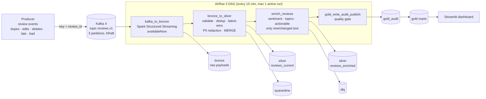

# ReviewLens: streaming review analytics with Kafka, Spark, Delta Lake and Airflow

 -brightgreen)

ReviewLens turns a messy stream of customer review events into **trusted product-health metrics**: which products are getting worse, and why. It's an end-to-end pipeline that runs free with one `docker compose up` on an 8 GB laptop.

**The engineering focus** is what production pipelines need beyond moving data. It has an explicit data contract and quarantine for bad records. Duplicates, out-of-order events, late data and deletes are all handled. Re-running a step gives the same result, so retries are safe. Every stage keeps its place in a checkpoint. Results are only published if data-quality checks pass. And every major choice is written up with its trade-offs in [docs/adr](docs/adr).

## Architecture



All tables are **Delta Lake** in a Docker volume. Spark runs in **local mode** inside the Airflow container, only while a task runs. That's how Kafka, Spark and Airflow fit on an 8 GB laptop ([ADR-0002](docs/adr/0002-airflow-spark-local-mode.md)).

| Layer | Table | Guarantee |
|---|---|---|
| Bronze | `bronze/reviews`: raw Kafka payloads plus offsets, partitioned by `ingest_date` | Never rejects data. Exactly-once from Kafka via checkpoint + Delta sink |
| Silver | `reviews_current`: one row per review, redacted text, deletion markers ("tombstones") | Same result whether events are replayed or arrive out of order |
| Silver | `reviews_enriched`: insight per `(review_id, text_hash, prompt_version, model)` | Unchanged text is never re-enriched |
| Gold | `fct_review`, `mart_product_health_daily`, `mart_topic_issues`, `_quality_runs` | Published only if the blocking checks pass |

## Quickstart (free)

**Option A: in the browser, nothing to install.** Use GitHub Codespaces: on the repo page choose **Code → Codespaces → Create codespace**. The [devcontainer](.devcontainer/devcontainer.json) asks for a 4-core / 16 GB machine with Docker already set up. GitHub's free monthly Codespaces quota covers a few hours a day of use. Stop the codespace when you're done.

**Option B: on your own machine,** with Docker Desktop. New to Docker on Windows? Follow [docs/setup-windows.md](docs/setup-windows.md) first. It covers WSL2, the memory settings and the first run.

Then, in either case:

```bash
docker compose up -d --build
```

| What | Where |
|---|---|
| Airflow (DAG `reviewlens_pipeline`, runs every 15 min, or press ▶ to trigger) | http://localhost:8080 |
| Dashboard | http://localhost:8501 |
| Kafka from your laptop | `localhost:29092` |

```bash
docker compose logs -f producer            # watch events stream into Kafka
docker compose exec airflow python -m pytest /opt/reviewlens/tests -q   # all tests incl. Spark
docker compose down                        # stop (data kept); add -v to wipe everything
```

**No Docker?** `pip install -e ".[dev]" && python -m reviewlens.pipeline` runs a lite version of the same stages in plain Python with DuckDB, in about 5 seconds. CI runs it on every push.

**Optional free AI model:** install [Ollama](https://ollama.com), run `ollama pull llama3.2:3b`, then start the stack with `ENRICHER=ollama docker compose up -d`. Enrichment then uses a local LLM with schema-constrained JSON output instead of the keyword rules. Expect it to be slow on CPU.

## What to look at (for reviewers)

| Concern | Where |
|---|---|
| Data contract + quarantine | [contracts/review_event.v1.json](contracts/review_event.v1.json), `parse_and_validate` in [bronze_to_silver.py](src/reviewlens/spark/bronze_to_silver.py) |
| Same result on replay and reordering | `merge_into_silver` and the Spark tests in [tests/spark](tests/spark/test_spark_stages.py) |
| Exactly-once ingestion from Kafka | [kafka_to_bronze.py](src/reviewlens/spark/kafka_to_bronze.py), [ADR-0003](docs/adr/0003-kafka-ingestion-availablenow.md) |
| Unreliable enrichment handled (retries, DLQ, circuit breaker) | [spark/enrich.py](src/reviewlens/spark/enrich.py), [enrich.py](src/reviewlens/enrich.py) |
| Quality gate before publishing (write-audit-publish) | [spark/gold.py](src/reviewlens/spark/gold.py) |
| Orchestration | [airflow/dags/reviewlens_pipeline.py](airflow/dags/reviewlens_pipeline.py) |
| Sizing for an 8 GB machine | [docker-compose.yml](docker-compose.yml) memory limits, [ADR-0002](docs/adr/0002-airflow-spark-local-mode.md) |
| Ownership | [SLOs and runbook](docs/ownership/slos-and-runbook.md) |
| Path to production on AWS | [ADR-0006](docs/adr/0006-local-first-cloud-ready.md), reference design in [cloud/aws](cloud/aws) |

## Design decisions

| ADR | Decision | Main trade-off |
|---|---|---|
| [0001](docs/adr/0001-delta-lake.md) | Delta Lake tables | ACID MERGE and time travel vs. plain Parquet simplicity |
| [0002](docs/adr/0002-airflow-spark-local-mode.md) | Airflow + Spark in local mode, no Spark cluster | Fits 8 GB vs. horizontal scale (which this volume doesn't need) |
| [0003](docs/adr/0003-kafka-ingestion-availablenow.md) | Kafka → bronze with streaming `availableNow`, triggered by Airflow | Exactly-once bookkeeping without an always-on consumer vs. freshness in seconds |
| [0004](docs/adr/0004-idempotency-late-data-deletes.md) | Latest-wins MERGE, tombstones, replay from bronze | Simplicity vs. full change history (SCD2) |
| [0005](docs/adr/0005-enrichment-stage.md) | Enrichment as its own stage with cache, DLQ and circuit breaker | Cost and blast radius vs. one more stage |
| [0006](docs/adr/0006-local-first-cloud-ready.md) | Local-first, cloud-ready | $0 to run vs. production fidelity |

## Repo map

```
docker-compose.yml        Kafka (KRaft) · kafka-init · producer · Postgres · Airflow (+Spark) · dashboard
docker/                   Airflow+Spark+Java image, app image (producer & dashboard)
airflow/dags/             reviewlens_pipeline DAG
src/reviewlens/           contracts · generator/producer · transform (Python reference) · enrich · quality
src/reviewlens/spark/     kafka_to_bronze · bronze_to_silver · enrich · gold
dashboard/                Streamlit app on gold tables
tests/                    unit tests (Python) + tests/spark (Spark, run in CI / container)
docs/                     ADRs, ownership (SLOs/runbook), interview prep, Windows setup
cloud/aws/                optional reference design for production on AWS (Glue/Iceberg/Step Functions/Bedrock), not needed to run
```

## Interview prep
[Presenting this project](docs/interview/project-defense.md) · [System design playbook](docs/interview/system-design-playbook.md)
